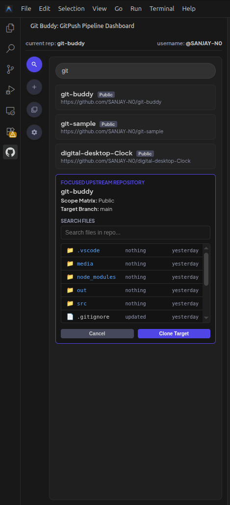
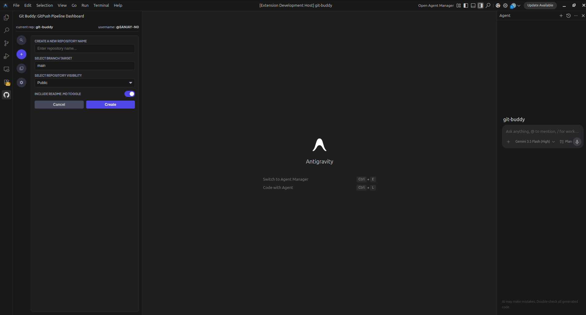
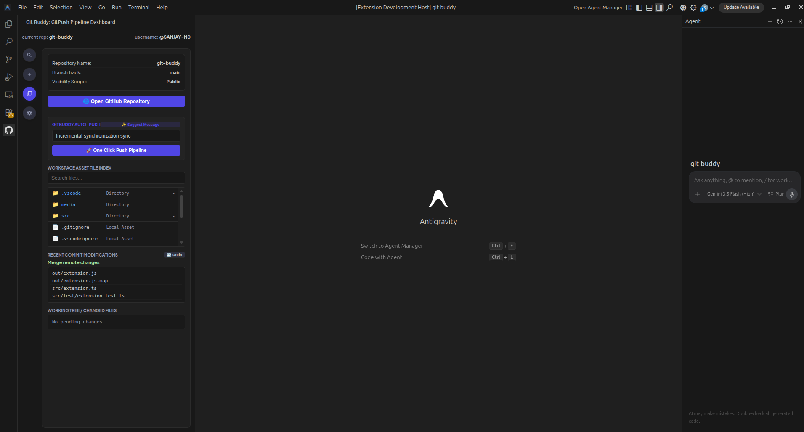
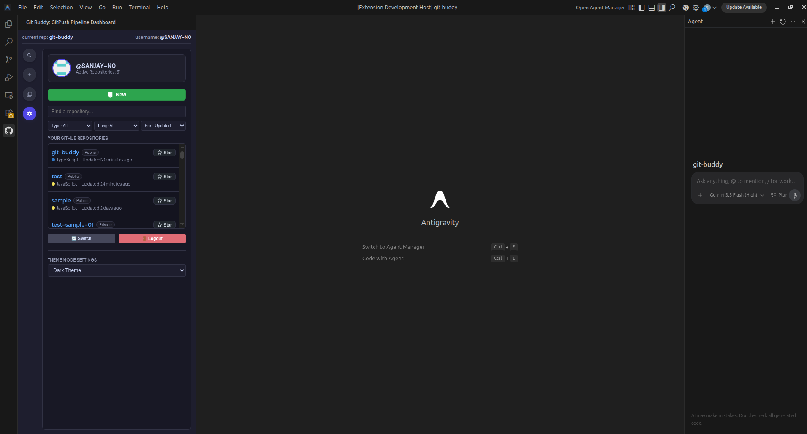
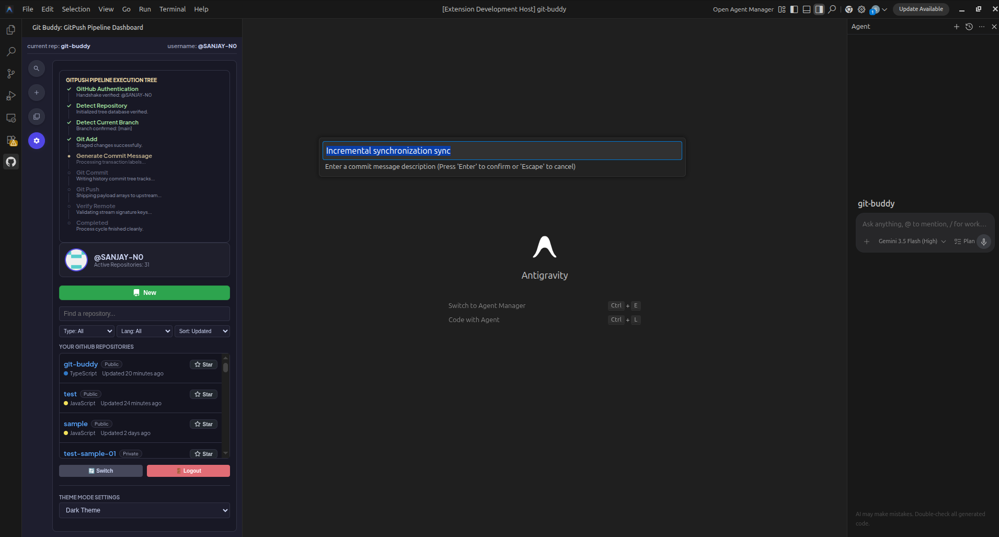
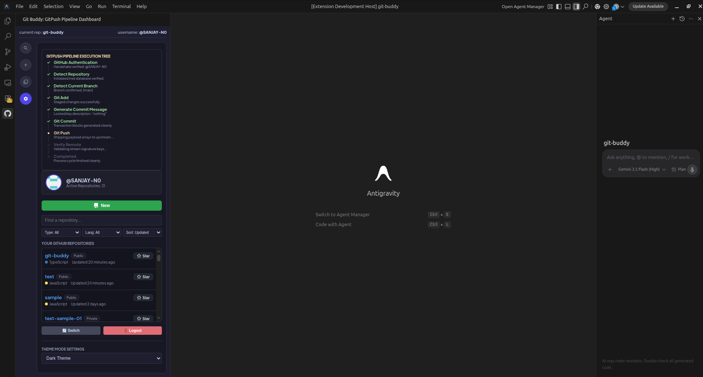

# Git Buddy 🚀

**Git Buddy** is an interactive, high-speed, and automated Git push pipeline provider for VS Code. It replaces multi-step manual git staging, committing, authentication, and pushing with a single click, using an elegant glassmorphism stepper dashboard right in your sidebar.

-
    

## 📸 Screenshots

<p align="center">
  
  
</p>

<p align="center">
  
  
  
</p>


---

## Key Features 🌟

### 1. High-Speed One-Click Push Pipeline
- Runs the entire Git flow: stages all untracked/modified files, prompts or autogenerates a commit message, updates the remote configuration with temporary OAuth credentials, pushes code securely, and cleanly restores the upstream remote URL.
- Live progress tracker directly in the VS Code sidebar via an interactive stepper dashboard.

### 2. Glassmorphic Toast Notifications
- Responsive, premium CSS floating alerts (`Success`, `Error`, `Warning`, `Info`) with slide-in/slide-out animations.
- Reports system errors, OAuth authentication failures, and git merge/push issues directly inside the webview.

### 3. Commit Message Heuristic Suggestion ✨
- Analyzes changed files in your workspace under the hood.
- Suggests semantic, clean message structures (e.g., `feat:`, `test:`, `docs:`, `chore:`) depending on whether you updated application source code, unit tests, configurations, or README markdown.

### 4. Undo and Redo Last Commit
- **Undo (Soft Reset)**: Soft-resets the latest local commit (`git reset --soft HEAD~1`) while retaining all changes and storing the previous message.
- **Redo Commit**: Instantly runs `git add .` and re-commits with the cached message in a single click.

### 5. Copiable Commit Telemetry
- Inspects your latest repository status (current branch, modification status, file count, and last commit details).
- Click the short commit hash badge in the telemetry header to copy it directly to your clipboard.

---

## Extension Interface 🖥️

The extension registers the **Git Buddy** panel in the Activity Bar. Clicking it reveals the dashboard with two primary views:

1. **Uninitialized Workspace / Setup View**:
   - Quick forms to initialize a new Git repository (`git init`) or clone an upstream repository.
   - Guard rails to prevent overwriting existing files (e.g., `README.md` collision alerts).
2. **Current Repository Dashboard**:
   - Telemetry status showing repository name, active branch, modification flag, and copyable short commit hash.
   - Autocomplete commit message input with **✨ Suggest Message** integration.
   - Interactive workflow pipeline showing real-time step execution (Git status, check branch, stage, commit, authenticate, push, clean remote, verification).
   - **Undo Last Commit** and dynamic **Redo Commit** controls.

---

## Commands Registered ⌨️

The extension exposes the following commands in the command palette:

- `git-buddy.oneClickPush` — Runs the high-speed automated push script.
- `git-buddy.connectGitHub` — Integrates VS Code GitHub account session credentials.
- `git-buddy.logoutGitHubAction` — Logs out and clears the OAuth token cache.
- `git-buddy.undoCommit` — Performs a soft-reset on the last local commit.
- `git-buddy.redoCommit` — Re-commits the last undone state with its stored message.
- `git-buddy.suggestCommitMessage` — Runs heuristic analysis to generate a commit message.

---

## Installation & Setup 🛠️

### Prerequisites
- Make sure [Git](https://git-scm.com/) is installed and added to your system `PATH`.
- VS Code version `1.74.0` or higher.

### Development Setup
1. Clone this repository to your machine.
2. Open the directory in VS Code.
3. Install dependencies:
   ```bash
   npm install
   ```
4. Compile the TypeScript sources:
   ```bash
   npm run compile
   ```
5. Press `F5` to open a new **Extension Development Host** window to debug the extension.

### Running Tests
To execute the automated Mocha test suite:
```bash
npm test
```

---

## License 📄
This project is licensed under the MIT License.
