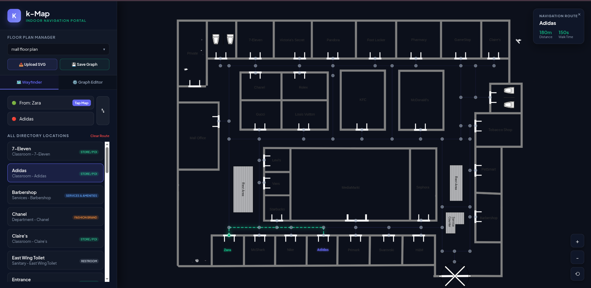

# k-map-runner

`k-map-runner` is a web-based indoor navigation portal and wayfinding management network. The platform allows users to upload custom SVG floor plans, plot navigation paths using an interactive Graph Editor, and calculate real-time shortest-path routing between points of interest.



## 🚀 Features

* **Indoor Wayfinding:** Calculate precise paths between indoor locations (e.g., from *Zara* to *Adidas*) with distance and walking time tracking.
* **Graph Editor:** Visually map out walking paths, connection nodes, and intersections directly over an uploaded floor plan.
* **Floor Plan Manager:** Upload custom SVG layouts and save network graphs dynamically.
* **Directory Search:** Organized sidebar navigation filtering locations by categories like Brands, Stores, Restrooms, and Services.

---

## 📂 Project Structure

As shown in the repository layouts:
* `server.js` - Node.js Express server to handle routing, serving static assets, and backend configuration.
* `public/` - Contains the core frontend client assets, including the interactive UI layout and HTML canvas systems.
* `img1.png` - Application preview screenshot used for documentation.

---

## 🛠️ Getting Started

### Prerequisites
Make sure you have [Node.js](https://nodejs.org/) installed on your machine.

### Installation

1. **Clone the repository:**
   ```bash
   git clone [https://github.com/SANJAY-N0/k-map-runner.git](https://github.com/SANJAY-N0/k-map-runner.git)
   cd k-map-runner
